Knowledge Graph Browser is a tool for visual exploration of knowledge graphs.

**You can start exploring knowledge graphs using our [demo](https://try.kgbrowser.opendata.cz).**

This website is an accompanying website for the paper titled "Interactive and iterative visual exploration of knowledge graphs based on shareable and reusable visual configurations" which is currently under review.

We prepared various knowledge graph visualisations if you want to see something quickly.
They are not just images.
They are interactive graph visualisations you can use as a starting point for your own exploration.

You can start with famous personalities:

- [European Commissioners from Czechia and Germany](https://try.kgbrowser.opendata.cz/?load=https://raw.githubusercontent.com/martinnec/knowledge-graph-browser-website/main/examples/czech-and-german-european-commissioners.kgvb)
- [Signatories of Charter 77](https://try.kgbrowser.opendata.cz/?load=https://raw.githubusercontent.com/martinnec/knowledge-graph-browser-website/main/examples/charter-77-signatories.kgvb)
- [Marie Curie-Skłodowská's family and work](https://try.kgbrowser.opendata.cz/?load=https://raw.githubusercontent.com/martinnec/knowledge-graph-browser-website/main/examples/curie-family-and-work.kgvb)
- [Chemical elements in the periodic table and their discoverers](https://try.kgbrowser.opendata.cz/?load=https://raw.githubusercontent.com/martinnec/knowledge-graph-browser-website/main/examples/periodic-table.kgvb)
- [Family tree of Charles I of Austria](https://try.kgbrowser.opendata.cz/?load=https://raw.githubusercontent.com/martinnec/knowledge-graph-browser-website/main/examples/charles-I-of-austria-family-tree.kgvb)
- [What do Madeleine Albright, Bill Clinton, George W. Bush, Táňa Fischerová, Miloš Zeman, Mick Jagger, Charlie Watts, Keith Richards have in common?](https://try.kgbrowser.opendata.cz/?load=https://raw.githubusercontent.com/martinnec/knowledge-graph-browser-website/main/examples/common-albright-clinton-bush-fischerova-zeman-jagger-richards-watts.kgvb)

You can also try to explore MEPs (members of parliaments):

- [London and Prague mayors who were or are MEPs in their national parliaments](https://try.kgbrowser.opendata.cz/?load=https://raw.githubusercontent.com/martinnec/knowledge-graph-browser-website/main/examples/london-prague-mayors-as-meps.kgvb)
- [Aristocratic MEPs of the Czech Parliament](https://try.kgbrowser.opendata.cz/?load=https://raw.githubusercontent.com/martinnec/knowledge-graph-browser-website/main/examples/aristocratic-members-of-chamber-of-deputies-of-czechia.kgvb)
- [Moviemakers and writters in the Czech Parliament](https://try.kgbrowser.opendata.cz/?load=https://raw.githubusercontent.com/martinnec/knowledge-graph-browser-website/main/examples/moviemakers-and-writers-as-members-of-chamber-of-deputies.kgvb)

The basic principle of the browser is to enable users to discover different knowledge graphs through different views defined by various browsing configurations.
Real knowledge graphs are often too complex for human users and generic tools for knowledge graph visualisation and visual exploration are therefore quite hard to use.
The basic idea behind the Knowledge Graph Browser is to enable knowledge graph experts to configure a set of simpler views on knowledge graph nodes which can be then used by non-experts for browsing a knowledge graph from given points of view defined by the experts.
Anyone is free to create own configuration, publish it as Linked Open Data and let users to enjoy knowledge graph exploration.

If you are interested in the raw visual configurations demonstrated in the paper, you can browse them using the links below:

- scientists: [file](https://raw.githubusercontent.com/martinnec/knowledge-graph-browser-website/main/configurations/config-scientists.ttl) [resource](https://linked.opendata.cz/resource/knowledge-graph-browser/configuration/wikidata/scientists)
- scientists with their works: [file](https://raw.githubusercontent.com/martinnec/knowledge-graph-browser-website/main/configurations/config-scientists-works.ttl) [resource](https://linked.opendata.cz/resource/knowledge-graph-browser/configuration/wikidata/scientists-works)
- scientists with their works and groups: [file](https://raw.githubusercontent.com/martinnec/knowledge-graph-browser-website/main/configurations/config-scientists-works-groups.ttl) [resource](https://linked.opendata.cz/resource/knowledge-graph-browser/configuration/wikidata/scientists-works-groups)

<h1 id="grouping-of-clusters-extension">Grouping of clusters extension</h1>

### Table of Contents

- [Motivation](#motivation)
- [Glossary](#glossary)
- [How to use the extension?](#how-to-use-the-extension)
  - [Configuration selection](#configuration-selection)
  - [Get started with graph exploration](#get-started-with-graph-exploration)

---

<h1 id="motivation">Motivation</h1>

We all know how zoom in/out works on mapping platforms such as [google maps](https://maps.google.com), maps.cz, etc. Zoom is used to increase or decrease the zoom level at a specific point and show more or less detail on the map.

The extension of the original Knowledge Graph browser is inspired by this feature of mapping platforms. Original knowledge graph exploration is proposed in a research paper ["Iteractive and iterative visual exploration of knowledge graphs based on shareable and reusable visual configurations"](https://www.sciencedirect.com/science/article/pii/S1570826822000105).

<h1 id="glossary">Glossary</h1>

In this part of the guide, you will learn the necessary terms that will help you understand the basic principle of how the extension works. They may differ from the usual terms you may be familiar with.

You can skip this section for now and go to [How to use the extension?](#how-to-use-the-extension)

<h3 id="hierarchical-relationships-glossary">Hierarchical relationship</h3>

In the "Grouping of clusters" approach, we introduce the concept of hierarchical relationships. 

Typically, nodes in a graph are related to each other, for example, a company has employees, university has scientists, scientist has awards, scientist writes scientific papers, university has departments, and many other examples. 

One possible way to visualize such relationships is to create an edge between parent and child. But there is also another way, namely adding a hierarchy between nodes. In such case, parent node is visualized as a larger node containing child nodes inside.

Figure 1 below shows an example with universities and departments:

    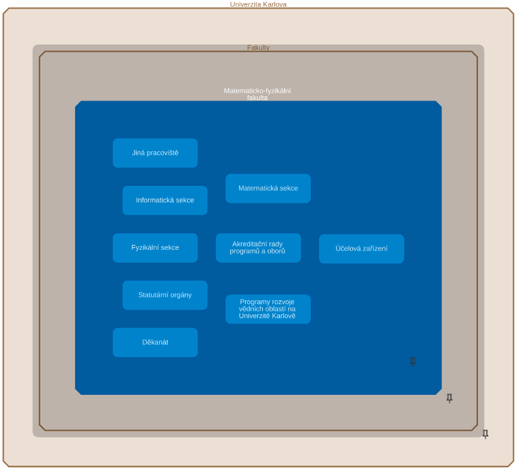 
    <em>Figure 1. Parent-child relationship</em>

Here the node *"Fakulty"* is the parent node of the node *"Matematicko-fyzikální fakulta"*, which, in turn, is the parent of the internal nodes that are light-blue and have titles inside the node.

Each such node hierarchy represents a [hierarchical group](#hierarchical-group-glossary).

> **Warning** \
> Hierarchical relationships are predefined by a technician in the visual configuration. You cannot choose them in the user interface.

[Non-hierarchical](#non-hierarchical-relationships-glossary) relationships are also possible. 

<h3 id="non-hierarchical-relationships-glossary">Non-hierarchical relationship </h3>

> **Definition** \
> Non-hierarchical relationships are represented by an edge between nodes.

For example, "the department teaches the subject" relationship can be visualized as non-hierarchical. An example is shown in the Figure 2 below.

    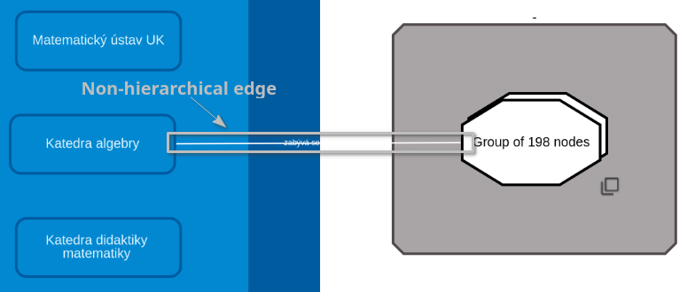 
    <em>Figure 2. Non-hierarchical edge</em>

> **Note** \
> Non-hierarchical relationships are all relationships other than [hierarchical](#hierarchical-relationships-glossary).

<h3 id="hierarchical-class-glossary">Hierarchical class</h3>

> A hierarchical class is a visual class that defines which [hierarchical group](#hierarchical-groups-glossary) a node belongs to. A node can only be assigned to one hierarchical class.

A hierarchical class, if it exists, is shown along with a label of a node on the detail panel. See Figure 3 below for more details.

    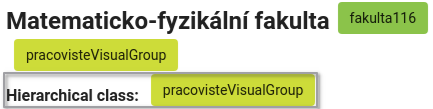 
    <em>Figure 3. Hierarchical class</em>

> **Note** \
> A hierarchical class (or hierarchical group class) is a common class for all nodes to be placed in a same [hierarchical group](#hierarchical-groups-glossary).

> **Warning** \
> Each node must be assigned to some hierarchical group class in case it needs to be placed in any hierarchy.

<h3 id="hierarchical-level-glossary">Hierarchical level</h3>

> **Definition** \
> A hierarchical level of a node indicates the depth of a hierarchy at which a node resides.

The amount of detail displayed on maps (in mapping platforms) depends on a zoom level. [Grouping of clusters](#grouping-of-clusters-glossary) approach uses the same idea. At the deepest (highest) level of the hierarchy, the graph shows all possible details. And at the lowest level of the hierarchy, the graph shows only those single nodes that are representatives of hierarchies themselves. 

<h3 id="current-hierarchical-level-glossary">Current hierarchical level</h3>

> **Definition** \
> A current hierarchical level is the deepest [hierarchical level](#hierarchical-level-glossary) shown in the graph area.

At the moment when child nodes collapse into their parents, the current hierarchical level decreases by 1, and when child nodes with a hierarchical level higher (deeper) by 1 than the current hierarchical level appear, the current hierarchical level increases by 1.

<h3 id="hierarchical-groups-glossary">Hierarchical group</h3>

> **Definition** \
> A hierarchical group is a cluster of nodes that are related to each other by hierarchical relationships. 

Each node in a hierarchical group must have the [hierarchical class](#hierarchical-class-glossary) which represents that hierarchical group.

An example of one such hierarchical group is shown in Figure 1 above.

> **Warning** \
> Hierarchical groups are predefined by a technician in the visual configuration. You cannot define them in the user interface.

<h3 id="visual-group-glossary">Visual group</h3>

> **Definition** \
> A visual group is a cluster of nodes located in the same area on a graph. Nodes that belong to the same visual group are placed under the same "pseudo-parent" node representing the visual group itself.

An example of a visual group is shown in the Figure 4 below. The "pseudo-parent" node is a gray node with white nodes inside.

    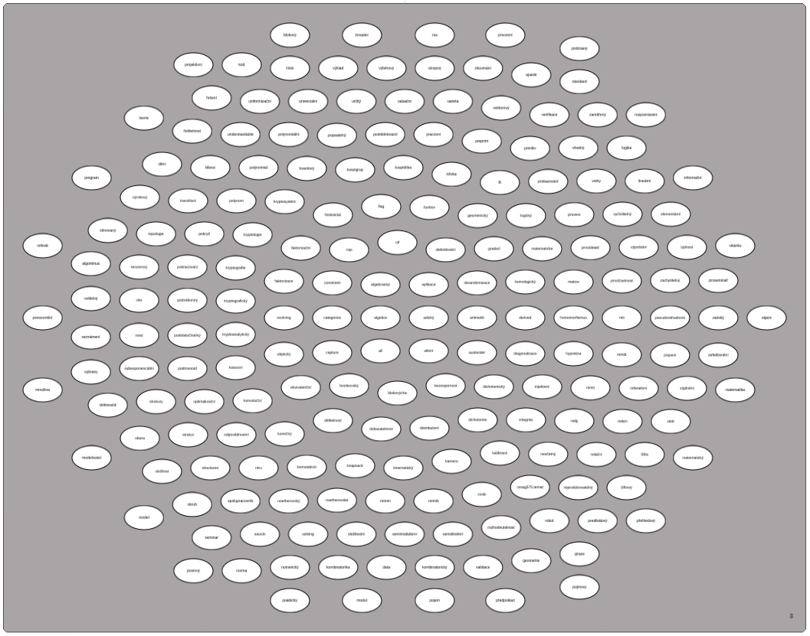 
    <em>Figure 4. Visual group</em>

> **Warning** \
> A visual group is predefined by a technician in the visual configuration. You cannot define them in the user interface.

Each node in a visual group must have an additional visual group class representing that visual group. It can be identical to the hierarchical class.

> **Note** \
> Hierarchical groups themselves can be interpreted as visual groups. In such a case, there is no need for a "pseudo-parent".

An example of two visual groups "pracovisteVisualGroup" and "tema" is shown in Figure 5 below (later on we will use "pracovisteVisualGroup" as the visual group).

    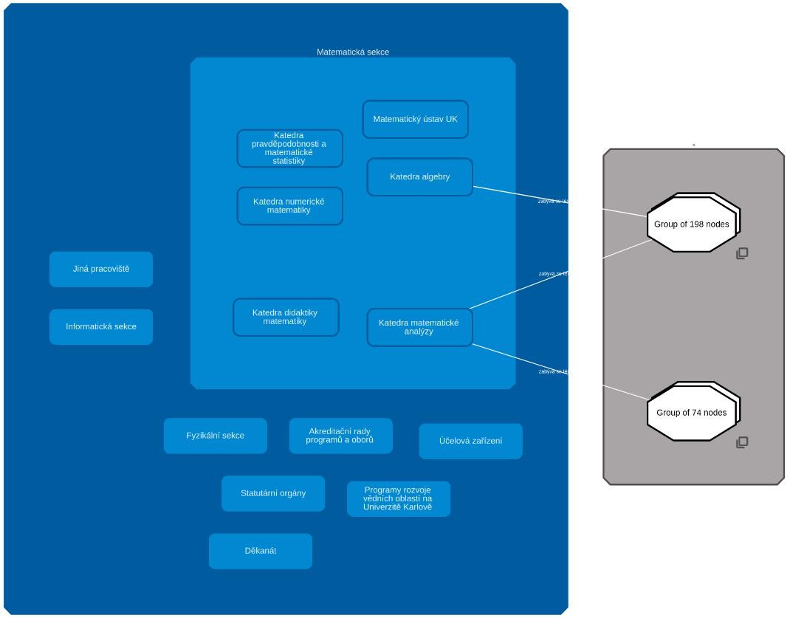 
    <em>Figure 5. Visual groups. To the left is "pracovisteVisualGroup" visual group and to the right is "tema" visual group</em>

> **Note** \
> The main advantage of visual groups is that you can easily move all the nodes that belong to the same group across the entire graph area at the same time. This way they won't be scattered all over the graph area. 

<h3 id="cluster-glossary">Cluster</h3>

> **Definition** \
> Cluster is a set of the same or similar elements, assembled or located close to each other. 

<h3 id="grouping-glossary">Grouping</h3>

> **Definition** \
> Grouping is the task of converting clusters into a single node.

<h3 id="checkbox-glossary">Checkbox</h3>

The "Scaling options" checkbox is used to choose whether to group clusters or to zoom. It is placed in the right top corner of the graph area. See the Figure 6 below for more detail.

    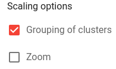 
    <em>Figure 6. Scaling options</em>

<h3 id="grouping-of-clusters-glossary">Grouping of clusters</h3>

When you zoom in at a specific point on the mapping platforms, at each zoom level you see more and more details about the region you zoom in, and when you zoom out, some details disappear. 

The same principle is used in the "Grouping of clusters" extension, namely, when you zoom in, you see more detail in terms of nodes, and when you zoom out, you see less detail in terms of nodes.

The "Grouping of clusters" algorithm must first cluster the nodes into a [cluster](#cluster-glossary), and then collapse this cluster into a single group node. Which nodes to cluster is determined by an algorithm based on position of the nodes. This algorithm uses well-known clustering methods: k-Means clustering [1] and k-Medoids clustering [2] (what method to use is defined by the technician).

The basic approach of the algorithm is that it creates several centroids, generates from them an empty group (k-Means clustering [1]) or a group consisting of a single node (k-Medoids clustering [2]), and then adds surrounding nodes to the closest group.

The clustering of nodes is determined based on the [hierarchical class](#hierarchical-class-glossary), the parent node, the [level of the hierarchy](#hierarchical-level), and the visual class. 

First of all, nodes must be clustered by the hierarchical group class to which they belong. 

The second condition of clustering is that the node's [hierarchical level](#hierarchical-level) must be equal to the [current hierarchical level](#current-hierarchical-level-glossary).

> **Warning** \
> The algorithm always clusters the nodes located at the [current hierarchical level](#current-hierarchical-level-glossary). When all nodes in the [current hierarchical level](#current-hierarchical-level-glossary) will be the only nodes of their parents, the algorithm will collapse those nodes into their parents and decrease the [current hierarchical level](#current-hierarchical-level-glossary) by 1.

As the map (in the mapping platforms) scales down and details disappear, new correlated details appear in their place that generalize the disappeared details. In our case, the parent node is such a generalization. Therefore, the next condition for clustering must be to cluster nodes that have the same parent node.

After all nodes that have the same parent node are filtered out, the algorithm filters out nodes that have the same visual class, unless multiple visual classes to be clustered together are explicitly specified in the visual configuration. 

> **Warning** \
> Visual classes that are allowed to be clustered together are predefined by a technician in the visual configuration. You cannot define them in the user interface.

Two cases can occur at the end of filtering:

- In the first case (an example is shown in the Figure 7 below), at the end of the filtering there are several nodes that can be clustered and grouped (within same parent). The algorithm then simply clusters and groups filtered nodes.

    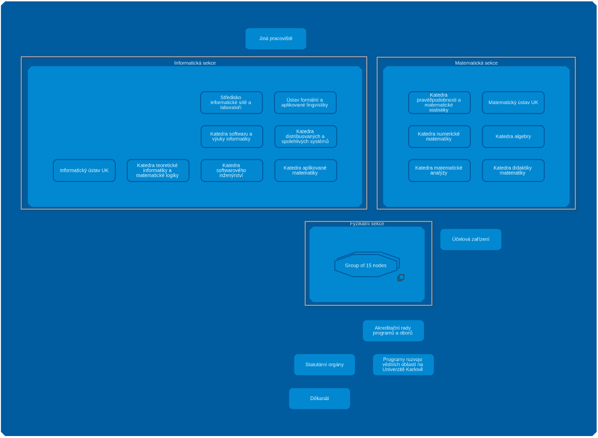 
    <em>Figure 7. Grouping of clusters (use-case of several child nodes)</em>

- In the second case, only one child node (per parent) remains at the end of the filtering (an example is shown in the Figure 8 below). 

  

      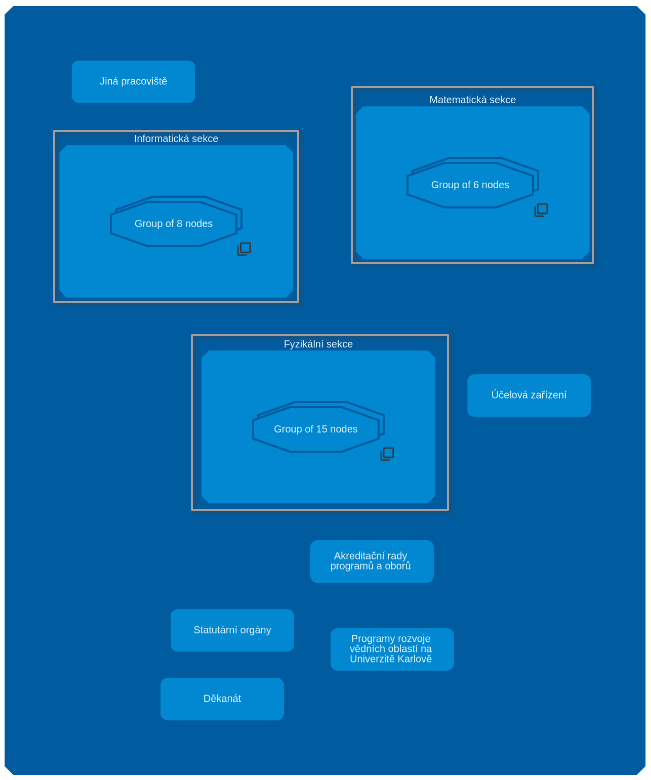 
      <em>Figure 8. Grouping of clusters (use-case of one child node)</em>
  

  This child node can represent a single child node or a group containing all of the parent's child nodes. In this case, the remaining child node (in each parent) should be collapsed into the parent node, but this should only happen when all the child nodes having [current hierarchical level](#current-hierarchical-level-glossary) are the only child nodes of their parents (as shown in the Figure 8 above).

  > **Note** \
  > After collapsing child nodes, the algorithm switches the [current hierarchical level](#current-hierarchical-level-glossary) one level lower. During this operation, all [non-hierarchical](#non-hierarchical-relationships-glossary) edges from child nodes are moved to the parent node.

When ungrouping ("Grouping of clusters" is selected in the [checkbox](checkbox-glossary) and "plus" button is clicked), only nodes at the [current hierarchical level](#current-hierarchical-level-glossary) can be ungrouped.

There are two cases:

- In the first case, there is at least one group at the [current hierarchical level](#current-hierarchical-level-glossary). 
  > **Warning** \
  > In such case, algorithm ungroups random number of random groups. 

- In the second case, there are only parent nodes which contain inside collapsed child nodes. In such case, algorithm shows collapsed child nodes.

    > **Note** \
    > In such case the [current hierarchical level](#current-hierarchical-level-glossary) increases by 1.

<h3 id="node-removal-glossary">Node removal</h3>

> Deleting a node propagates the recursive deletion of a node's descendants.

<h1 id="how-to-use-the-extension">How to use the extension?</h1>

This guide will explain and teach you how the "Grouping of clusters" extension works and what benefits it provides.

<h2 id="configuration-selection">Configuration selection</h2>

> **Note** \
> The Knowledge Graph Browser currently supports only one configuration that allows this extension to be used.

**1)** Choose "Charles Explorer" meta-configuration. See the Figure 9 below.

    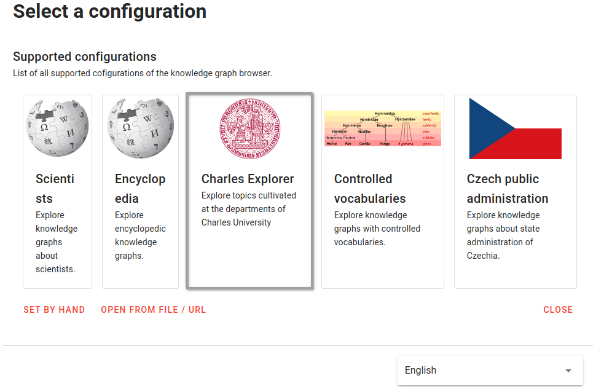 
    <em>Figure 9. Meta-Configuration selection</em>

**2)** Choose "Browsing topics cultivated at Charles University (with constraints)" configuration. See the Figure 10 below.

    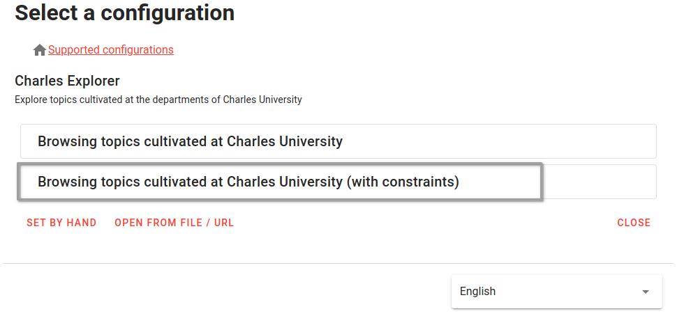 
    <em>Figure 10. Meta-Configuration selection</em>

**3)** Choose starting node

> **Warning** \
> Wait for the starting node to fully load (the loading sign will disappear and the starting node will look like at the picture below). This is a necessary step for the extension to work correctly. See the Figure 11 below.

    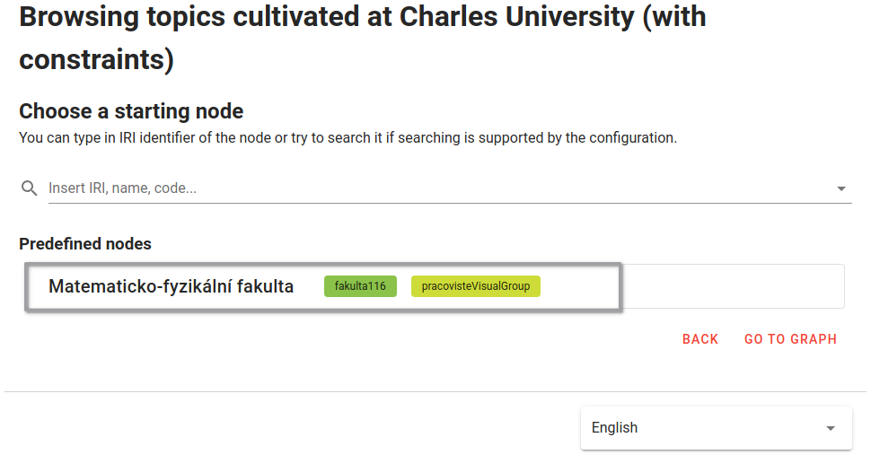 
    <em>Figure 11. Starting node</em>

<h2 id="get-started-with-graph-exploration">Get started with graph exploration</h2>

<h3 id="starting-node">Starting node</h3>

The starting node is shown in the same way as in other configurations.

<h3 id="hierarchical-expansions">Hierarchical expansions</h3>

There are [hierarchical](#hierarchical-relationships-glossary) and [non-hierarchical](#non-hierarchical-relationships-glossary) relationships.

Expansion queries listed in the detail panel under the "Available views" label allow you to show the neighborhood of the node in which that node is in either a [hierarchical](#hierarchical-relationships-glossary) or [non-hierarchical](#non-hierarchical-relationships-glossary) relationship with its neighbors.

The hierarchical and non-hierarchical expansions are listed below and shown in the Figure 12 below:

- Hierarchical expansions:
  - "Nadřazená pracoviště"
  - "Podřazená pracoviště"

- Non-hierarchical expansions:
  - "Témata pracoviště"
  - "Sdílená témata pracoviště"

    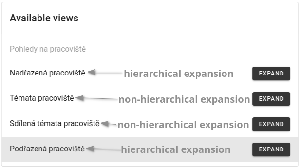 
    <em>Figure 12. Hierarchical and non-hierarchical expansions</em>

> **Note**
> - A [hierarchical group](#hierarchical-groups-glossary) can be sequentially build using hierarchical expansions (an example is shown in the Figure 1).
> - Non-hierarchical expansions expand a node with its neighborhood, where each neighbor is connected to that node by an edge.

<h3 id="checkbox-guide">Checkbox</h3>

The main tool that enable you to utilize the extension is the [checkbox](#checkbox-glossary). 

Using the checkbox, you can choose whether to do:
- [Grouping of clusters](#grouping-of-clusters-glossary)
- Zoom
- [Grouping of clusters](#grouping-of-clusters-glossary) and Zoom at the same time
- Neither one of them

> **Note**
> - When "Grouping of clusters" is selected, use "minus" (resp. "plus") button to group (resp. ungroup) nodes. **Mouse wheel not supported**.
> - By selecting a "Grouping of clusters" and "Zoom" at the same time, you can take an advantage of the main features of the mapping platforms (for more information see [Grouping of clusters](#grouping-of-clusters-glossary)). **Mouse wheel supported**.

<h3 id="node-removal-guide">Node removal</h3>

Below is shown an example of the node [removal](#node-removal-glossary):

Before removal of the "Informaticka sekce":

    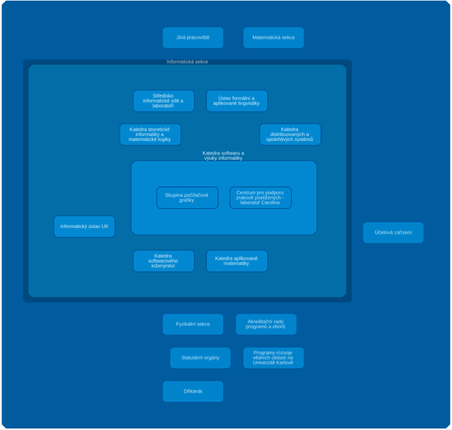 
    <em>Figure 13. Before removal (the node "Informaticka sekce" is selected for deletion)</em>

After removal:

    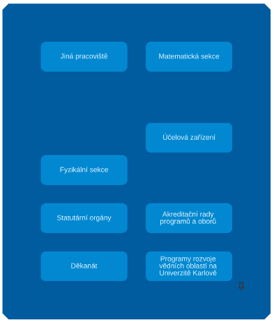 
    <em>Figure 14. After removal</em>

<h2 id="summary">Summary</h2>

The main motivation behind the "grouping of clustering" extension is to bring the concept of zooming from mapping platforms into the Knowledge Graph browser. Feel free to use the newly implemented features that will give you a fresh perspective on the graph.

<h1 id="references">References</h1>

[1] https://en.wikipedia.org/wiki/K-means_clustering

[2] https://en.wikipedia.org/wiki/K-medoids